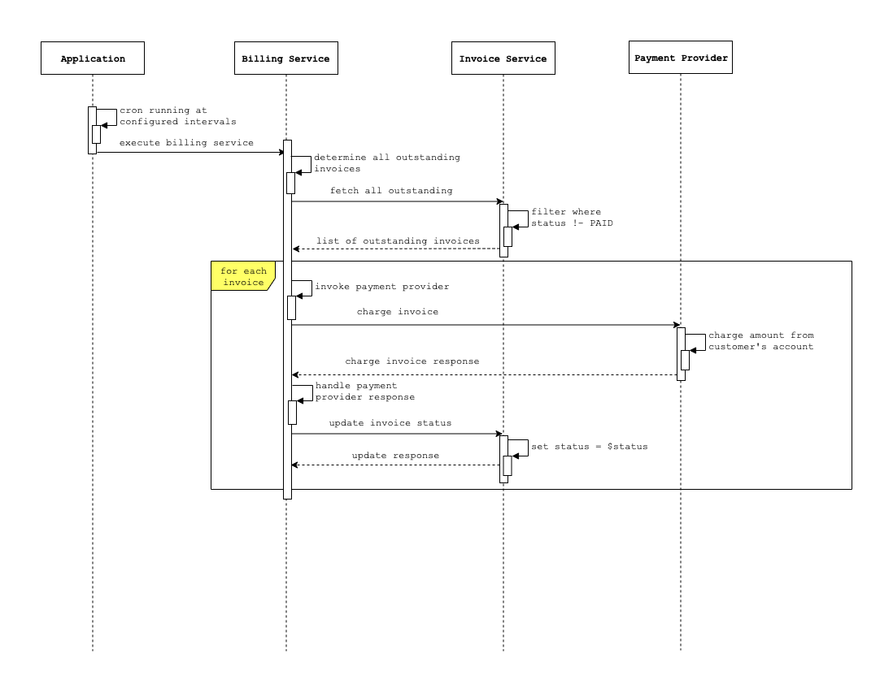
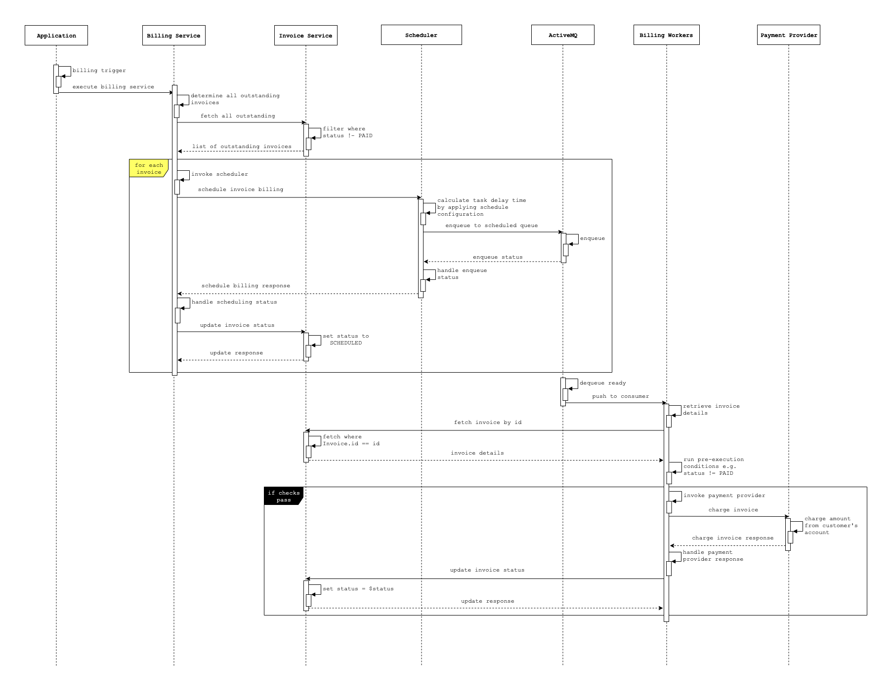

## RFC: Invoice Billing Scheduling
 
**Author(s)**: Kelvin Wahome

**Status**: `Draft`, **Open**, `Closed`, `Cancelled`

**Open Date**: 16 November 2019

**Close Date**: 25 November 2019

### 1. Background

As most "Software as a Service" (SaaS) companies, Pleo needs to charge a subscription fee every month. 
Our database contains a few invoices for the different markets in which we operate.
These invoices have an identifier, a reference to a customer, an amount and a status as shown below:

```kotlin
data class Invoice(
    val id: Int,
    val customerId: Int,
    val amount: Money,
    val status: InvoiceStatus
)
```

An invoice `amount` is expressed as a `Money` object which is a class containing a `value` and a `currency`:

```kotlin
data class Money(
    val value: BigDecimal,
    val currency: Currency
)
```

An invoice `status` is an enumeration that describes possible states of an invoice. Two are currently used:

```kotlin
enum class InvoiceStatus {
    PENDING,
    PAID
}
```

Settling/payment of invoices is desired on the first day of the month for invoices that are outstanding (taken to mean 
in those that are not in a `PAID` status).

A robust payment scheduling mechanism is thus needed. The mechanism should (among other properties):

- be horizontally scalable (distributable - ability to run on different machines
- guarantee at most once delivery - we only want to charge an invoice once
- guarantee durability and recoverability - we want the schedules to persist even after the application or its host are 
restarted
- be dynamically configurable with granularity and little code changes - we want control (preferably user input driven) 
to change when and how billing is scheduled e.g. we may want to bill every day or every week e.t.c. Level of granularity
is also rather important e.g. a customer may prefer to pay on a daily basis while another prefers monthly
- perform pre-execution checks - for extra precaution, we want to determine whether to proceed with the call to the 
payment provider based on predetermined rules e.g. `Invoice.Status` not being `PAID`. Configurability here is also
a consideration.
- support rescheduling - since failure is a reality in the world of systems, we want the ability to safely retry without
any unwanted side effects
- be extensible - we want the solution to be easily extended to fit future requirements
- be efficient and performant - as we work hard to grow the business, so does the number of customers and invoices to be
billed; scale. The solution should withstand increase in scale with a low resource footprint so as not to starve the
application
- be observable - we want the ability to peek into it and understand it's working for easy troubleshooting

The above desired properties set out the criteria against which competing solutions are adjudged and which is preferred
determined. 

### 2. Scope
The goal of this RFC is to prescribe a suitable mechanism for use in scheduling invoice payment transactions.
It addresses the problem of scheduling.

### 3. Competing solutions
#### 3.1 Solution 1: Cron backed polling based scheduling
This solution calls for the use of cron to schedule invoice payment jobs that run periodically at fixed times, dates, 
or intervals configured via expressions following the format:

```
# ┌───────────── minute (0 - 59)
# │ ┌───────────── hour (0 - 23)
# │ │ ┌───────────── day of the month (1 - 31)
# │ │ │ ┌───────────── month (1 - 12)
# │ │ │ │ ┌───────────── day of the week (0 - 6) (Sunday to Saturday;
# │ │ │ │ │                                   7 is also Sunday on some systems)
# │ │ │ │ │
# │ │ │ │ │
* * * * * command-to-execute
```

The prevailing scheduling requirement is that invoices payments are scheduled on the first day of every month. 
The cron expression equivalent is:

```
# every first day of the month

0 0 0 1 * ?
```

Triggered by the cron on the first of every month, the `BillingService` determines all invoices that are not in a `PAID`
status by delegating to the `InvoiceService`. It then tries to settle these invoices by delegating a request for payment 
to the `PaymentProvider`; an external dependency. This happens for each of the outstanding invoices one after the other.

The external call to the payment provider is a blocking I/O operation whose outcome is essential in determining the new
state of the invoice, a potential performance bottleneck presenting a risk of impairing invoices' billing. 
Running this call asynchronously with coroutine threads would be prudent.

If a customer account is charged successfully, the invoice is updated with a `InvoiceStatus.PAID` status. In the event
that a customer's account cannot be charged successfully, leaving the status as `InvoiceStatus.PENDING` is a feasible 
alternative especially where auto rescheduling is desired as the cron will run this job the next time it runs; but that
would only be on the first of the following month. A status of `InvoiceStatus.FAILED` can however be favored where 
explicitness and compensating or manual mechanisms are desired.

Using the [Quartz Scheduler](http://www.quartz-scheduler.org) makes cancelling and rescheduling jobs possible.



This solution has the following pros and cons:

**Pros:**
- Simple to implement
- The cron job is somewhat configurable since the expressions triggering it can be user input driven
- Crons are already built, reliable mechanisms of running tasks at specific time/intervals.
- It runs as a background task that will not consume resources when not running.
- Less infrastructure dependencies to maintain

**Cons:**
- Durability and recoverability cannot be guaranteed - a cron being a deferred job 
- Despite being configurable via cron expressions, a customer schedule level of granularity hard to achieve
- Limited horizontal scaling with an at most once delivery guarantee - ideally, a cron job should only run on one host 
as distributing it could lead to unwanted consequences from race conditions. 
[Quartz Scheduler](http://www.quartz-scheduler.org) cron jobs can be clustered but only one of the hosts in the cluster 
will do one job at a time. If a host or job fails, another host will retry the pending job. While this guarantees failure 
tolerance, it does very little for handling scale as only one job at a time can be done.
- Limited observability - we can inject log events and traces to gather some insights but that's as much as can be done
with this solution.
- Not suited for complex, event-driven tasks
- Cron does not offer tight scheduling constraints (neither sub-second, nor near-real-time)

#### 3.2 Solution 2: Time-based delay queue scheduling
This solution tries to overcome some of the limitations of solution 1 by a leveraging delayed task processor
(also called a background processor, asynchronous task queue etc).

Task queues are used as a mechanism to distribute work across threads or machines. A task queue's input is a unit of 
work, called a task, dedicated worker processes then constantly monitor the queue for new work to perform.

Examples of libraries offering delayed task queues (in various languages) include:
- [Celery](https://celery.readthedocs.io/en/latest/)
- [Resque](https://github.com/resque/resque)
- [Sidekiq](https://sidekiq.org/)

Distributed task processor rely on lightweight message passing via MOMs (message oriented middleware) to place jobs on 
multiple queues deferring processing for later. Some of these MOMs (aka message brokers) include:

- [RabbitMQ](https://www.rabbitmq.com/) - open source
- [ActiveMQ](https://activemq.apache.org/) - open source
- [Amazon SQS](https://aws.amazon.com/sqs/) - proprietary
- [Redis](https://redis.io/) - open source; an in-memory data structure multipurpose store, used as a database, cache 
and message broker.

On one end of the message broker is a publisher who places messages on a queue and on the other is a pool of dedicated
workers that know how to perform a task consuming from it. 

There are two models of dispatching messages to consumers:

1. `pull` - consumers poll a queue for ready messages; individually or in batches.
2. `push` - the message broker pushes ready messages down to consumers who are attached as listeners to a queue. 
This ensures that a consumer always has a local buffer of messages ready to process.

The message dispatch model in use is an important differentiating factor between MOMs.
As it's polling based, pulling messages individually is not very efficient and can increase the per message latency 
significantly. The danger with the push model is that without limiting the number of messages that are pushed to a 
consumer its client-side resources could become exhausted, a natural consequence of message consumption typically being 
much slower than message delivery. Message brokers thus have a message prefetch limit.

Most message brokers these days ship with delay and schedule message delivery capabilities. 
With this feature, the delivery of messages is delayed for a certain configurable time so that subscribers doesn't see 
them immediately effectively providing scheduling capabilities. 
[RabbitMQ](https://www.cloudamqp.com/docs/delayed-messages.html), 
[ActiveMQ](https://activemq.apache.org/delay-and-schedule-message-delivery),
[Amazon SQS](https://docs.aws.amazon.com/AWSSimpleQueueService/latest/SQSDeveloperGuide/sqs-delay-queues.html) and even
[Redis](https://redislabs.com/ebook/part-2-core-concepts/chapter-6-application-components-in-redis/6-4-task-queues/6-4-2-delayed-tasks/)
all ship with delayed queues although the implementation varies as the AMQP protocol on which they are based does not 
have a native delayed queue feature.

A key implementation difference is the internal data structure used in storing delayed messages. 
Ordinary queues with a TTL is the most prevalent delayed message implementation. Here, delayed messages are not ordered
and the broker has to constantly poll each message to determine it's readiness.

A more efficient strategy is to enqueue delayed messages in a sorted set data structure weighted by their delay time 
(a time-based queue) so that the most ready jobs are always on top of the queue.
It's the mechanism that
[Redis](https://redislabs.com/ebook/part-2-core-concepts/chapter-6-application-components-in-redis/6-4-task-queues/6-4-2-delayed-tasks/),
and [ActiveMQ](https://activemq.apache.org/delay-and-schedule-message-delivery) employ.

The storage strategy is an important detail for the efficiency of the background scheduler thread which just reads
messages which are scheduled for earliest processing rather than having to poll every message to determine readiness.
Moreover, delivering the most ready tasks first is always guaranteed.

This solution proposes the use of the delay and schedule feature of ActiveMQ to schedule invoice billing for execution
at a later time. Scheduling can happen way in advance of the target billing date e.g. on daily, on invoice creation etc.

The choice of ActiveMQ over Redis in spite of both having sorted persistence of delayed and scheduled messages is the
fact that ActiveMQ is a dedicated MOM optimized for reading messages, one at a time, with queue deadlock management 
guaranteeing an at most once delivery; very desirable in a system involving payments. 
With Redis, deadlock management and at most once delivery guarantees would have to be handled by the application.



With this solution, a `Scheduler` is responsible for determining the delay times of invoice billing tasks and 
enqueueing them on the broker's delay queue. This is based on configuration driven by a DSL that is suitable. 
For instance, cron expressions passed into date-time objects can be used as a starting point as it suits most of the
schedule definition needs. If need be, using a more advanced DSL backed by a rules engine can be incorporated without
breaking any existing functionality as it only needs to resolve to a date-time object from which a difference in time 
(the delay) can be calculated.

Since each invoice billing is scheduled in 'isolation' by applying the schedule configuration to derive a scheduling
delay, it's possible to apply schedule configuration at a much lower level of granularity. For instance, rather than
applying a global `first of the month`, each customer could have a schedule configuration of their own. Each invoice
could also have a schedule configuration of it's own differing from another invoice even though they belong to the same
customer.

As a start, and since ActiveMQ scheduled queue is persistent, scheduling of invoices is triggered by a cron running at 
an appropriate interval (hourly, daily) that retrieves invoices that are outstanding but not scheduled 
(those in the `InvoiceStatus.PENDING`) and running the `Scheduler` delegated from the `BillingService` on them. 
While still not ideal, it's a better divide and conquer alternative that incrementally schedules any new invoices at the
established intervals. Using the [Quartz Scheduler](http://www.quartz-scheduler.org) comes in handy as it guarantees 
that this cron runs only once at a time. Being clustered enhances failure tolerance.

A more robust strategy is an event-driven approach where upon creation of an `Invoice`, a domain event is broadcast
to all interested and subscribed "parties" (such as a billing service) who in turn react to it. An event is a message to
numerous independent endpoints sent when an action has been carried out. With such an approach, billing could be curved
out as a micro-service of it's own that reacts to domain events. The effort required is however significant since it's 
a much wider and more complex asynchronous framework.

Once the delay has expired, a scheduled billing task becomes ready and is made visible to a pool of consumers (workers)
listening on the task queue. The broker delivers the message to only one consumer, waiting for ACKs before it purges it
or reassigns.

The delivered message is parameterized so that consumers can execute the task. In our case, we want to avoid serializing
passing around the invoice details while enqueueing it for the consumers to use that in favour of a claim check pattern
where the identifier of the invoice gets enqueued and the consumers know how and where to claim it from; 
i.e. the database. Use of a claim check pattern guarantees that consumers will always fetch the most recent invoice
details reducing the risk of wrong actions. Moreover, it's a remedy against message size restrictions that might be
imposed at the infrastructure level.

With the invoice retrieved, a chain of pre-execution checks can be fired. Charging a customer's account via the 
`PaymentProvider` will only happen of this step passes. An example of a pre-execution check is ensuring that an invoice
is not settled already (i.e `status != InvoiceStatus.PAID`). They could get more complex than that backed by a rules 
engine utilizing the `Customer` and/or `Invoice` as context but as a start checking the status is sufficient. An
interceptor chain pattern should be used for this purpose.

**Pros:**
- Horizontally scalable (distributed) - more consumers can be added
- At most once delivery guaranteed at the infrastructure level
- Scheduled messages are persisted on the broker - durability and recoverability
- Sorted set guarantees O(log(n)) time complexity
- Fine grained configurability - schedule configuration can be made at a `Customer` and `Invoice` level
- Pre-execution checks are possible
- Observable - metrics available from ActiveMQ, also since most of there is application level control over most of the
logic, custom metrics can be employed
- Performant and efficient - due to horizontal scalability, iterative (reactive) scheduling and little to no 
polling threads
- Extensible and re-usable in another problem domain - the scheduling mechanism is not tight coupled to the problem
domain hence can be reused in another problem domain

**Cons:**
- Less infrastructure dependencies to maintain
- A bit more complex than solution 1

### 4. Next steps
- Implement time-based delay queue invoice billing

### 5. Notes
- Schedule configuration changes are not retroactive
